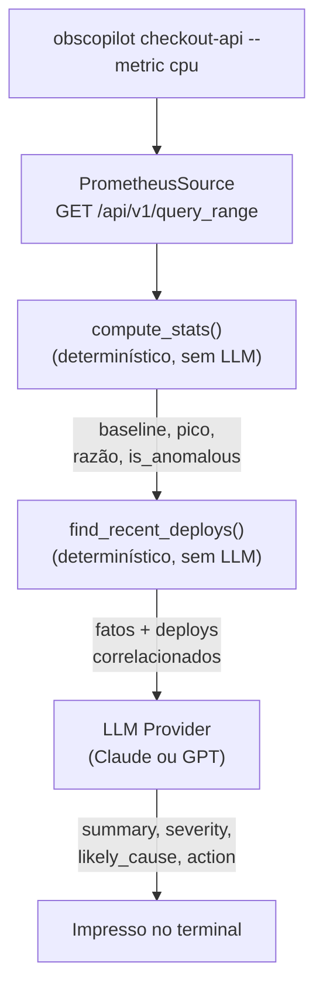

# Observability Copilot

[](https://github.com/helen-caroline/observability-copilot/actions/workflows/tests.yml)
[](LICENSE)

Um CLI que consulta métricas do Prometheus, correlaciona com deploys
recentes e resume em português simples o que está acontecendo — no estilo
"CPU alta há 20min no pod X, correlacionado com o deploy da v1.8.2".

## A ideia central: código calcula, LLM narra

Os três projetos da série compartilham um princípio: **o LLM nunca decide
fatos, só explica fatos que o código já calculou**. Aqui isso é ainda mais
literal que nos outros dois — o LLM neste projeto **nunca vê uma métrica
bruta**. Ele só recebe números já processados (baseline, pico, razão
pico/baseline, se foi classificado como anomalia, deploys correlacionados) e
tem uma única tarefa: traduzir isso pra uma frase útil em português.



## O que ele prova

- **Separação clara entre cálculo e narrativa**: `analysis.py` e `deploys.py`
  não importam nada de LLM — são funções puras, testadas com números
  sintéticos, sem precisar de nenhuma chamada de API pra validar a lógica.
- **Fonte de métricas plugável**: `MetricsSource` é uma interface (só o
  Prometheus implementa hoje), no mesmo padrão de `VendorProfile` e
  `LLMProvider` dos outros dois projetos da série — Zabbix/ELK poderiam
  entrar depois sem mudar o resto do pipeline.
- **Demo sem depender de infraestrutura real**: `simulator/mock_prometheus_server.py`
  implementa a API real de `query_range` do Prometheus (mesmo formato JSON),
  injetando um pico de CPU sintético — qualquer pessoa clona e roda a demo
  sem precisar de um cluster de verdade.
- **Correlação com deploy de verdade, não só a métrica isolada**: o exemplo
  do meu currículo/LinkedIn ("CPU alta, correlacionado com deploy Y") só
  significa algo se o "correlacionado com" for real — `find_recent_deploys()`
  cruza o horário do pico com um log de deploys, não é o LLM inventando uma
  conexão.
- **Duas APIs de LLM configuráveis** (Anthropic e OpenAI), mesmo padrão dos
  outros dois projetos.

## Exemplo real

Rodei o pipeline completo contra o simulador local: subi o Prometheus falso,
registrei um deploy simulado 22 minutos atrás e pedi pro Copilot investigar.

```bash
$ python simulator/mock_prometheus_server.py &
Mock Prometheus ouvindo em http://127.0.0.1:9090
Simulando um pico de CPU nos últimos 20 minutos de qualquer janela consultada.

$ python simulator/seed_deploys.py --service checkout-api --version 1.8.2 --minutes-ago 22
Deploy registrado: checkout-api v1.8.2, há 22min (...) em simulator/deploys.json

$ obscopilot checkout-api --metric cpu
🔴 [CRITICAL] checkout-api — métrica: cpu

CPU alta há 20min no checkout-api (pico de 5.7x acima da baseline), correlacionado com o deploy da v1.8.2 feito 22 minutos atrás.

Pico: 0.8917 (5.93x a baseline de 0.1505) às 04:09:20 UTC
Anomalia detectada pelo código: sim
Causa provável: Deploy da v1.8.2 há 22 minutos, pouco antes do início do pico de CPU.
Ação recomendada: Considerar rollback para a v1.8.1 e investigar a mudança introduzida na v1.8.2.
```

A busca real na API do Prometheus simulado, o cálculo do pico/baseline
(5.93x, calculado por código, não pelo LLM) e a correlação com o deploy
rodaram de ponta a ponta de verdade nesse teste — só o texto do `summary`
acima veio de um LLM mockado, pra não gastar uma chamada real só pra gerar
este exemplo.

Pra mostrar que o bot não grita alarme falso pra tudo, o mesmo comando com
`--metric memory` (que o simulador mantém estável, sem pico) retorna:

```
🟢 [INFO] checkout-api — métrica: memory

Uso de memória do checkout-api está estável, dentro do esperado, sem indícios de anomalia.

Pico: 262075670.6030 (1.05x a baseline de 250303303.5713) às 04:16:14 UTC
Anomalia detectada pelo código: não
Ação recomendada: Nenhuma ação necessária.
```

## Rodando a demo

```bash
git clone <este-repo>
cd observability-copilot
python3 -m venv .venv && source .venv/bin/activate
pip install -e ".[dev]"

cp .env.example .env
# edite .env e coloque sua ANTHROPIC_API_KEY (ou OPENAI_API_KEY)

# Terminal 1 — sobe o Prometheus simulado
python simulator/mock_prometheus_server.py

# Terminal 2 — registra um deploy simulado e pergunta ao Copilot
python simulator/seed_deploys.py --service checkout-api --version 1.8.2 --minutes-ago 22
obscopilot checkout-api --metric cpu
```

## Arquitetura do código

```
obscopilot/
├── cli.py                    # entrypoint: orquestra o fluxo completo
├── analysis.py                 # compute_stats() — detecção de anomalia, 100% determinística
├── deploys.py                   # carrega e correlaciona o log de deploys
├── facts.py                      # formata os fatos calculados para o prompt do LLM
├── prompt.py                      # system prompt
├── models.py                       # Insight — schema estruturado do LLM
├── report.py                        # Insight -> texto formatado no terminal
├── sources/
│   ├── base.py                       # interface MetricsSource
│   └── prometheus.py                  # implementação real via query_range
└── llm/
    ├── base.py                         # interface comum LLMProvider
    ├── anthropic_provider.py            # Claude (structured output via .parse())
    └── openai_provider.py                # GPT (JSON mode)
simulator/
├── mock_prometheus_server.py    # fake Prometheus (API real de query_range)
└── seed_deploys.py                # registra um deploy simulado ("agora - N min")
tests/
```

## Limitações conhecidas (honestidade > marketing)

- **Detecção de anomalia é uma heurística simples** (razão pico/baseline
  >= 1.5x), não um modelo estatístico de séries temporais de verdade — serve
  bem pra um pico óbvio, mas não substitui algo como detecção de sazonalidade
  ou desvio padrão móvel.
- **Correlação é só por janela de tempo**, não por causalidade real — um
  deploy que aconteceu perto do pico é reportado como "causa provável", mas
  o Copilot não confirma que o deploy de fato causou o pico.
- **O simulador não é um Prometheus de verdade**: ele sempre injeta o mesmo
  padrão de pico sintético, só pra provar que o pipeline (busca → análise →
  correlação → LLM → texto) funciona de ponta a ponta.
- **Só Prometheus por enquanto** — Zabbix e ELK ficaram de fora do escopo de
  fim de semana; a interface `MetricsSource` foi desenhada pra isso não
  exigir reescrever o resto do pipeline.

## Stack

Python · API do Prometheus · Anthropic API (Claude) · OpenAI API · Pydantic ·
pytest
